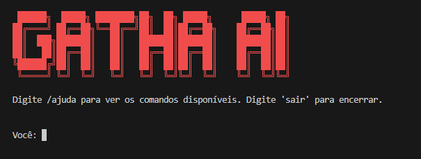

<div align="center">




# 🤖 GathaAI

### Assistente de IA para Terminal com Memória, Busca na Web e Suporte a Múltiplos Modelos

<p>
  
  
  
  
</p>


---

### 🧠 Memória Persistente
### 🌐 Busca na Web
### 📂 Análise de Projetos
### 🤖 IA Local ou APIs Externas

</div>

---

# 📖 Sobre

O **GathaAI** é um assistente de IA para terminal capaz de:

- 🧠 Lembrar conversas anteriores
- 📚 Aprender fatos sobre o usuário
- 📄 Ler arquivos e documentos
- 📂 Analisar projetos inteiros
- 🌐 Pesquisar na internet
- 🤖 Utilizar modelos locais ou APIs externas
- 📊 Exibir progresso em tempo real

---

# ✨ Funcionalidades

| Recurso | Descrição |
|----------|----------|
| 🧠 Memória Persistente | Armazena histórico usando SQLite |
| 🔍 Memória Vetorial | Busca contexto usando FAISS |
| 📚 Aprendizado de Fatos | Guarda preferências e informações |
| 📄 Leitura de Arquivos | TXT, PDF, PY, C, CPP, JAVA, ZIP |
| 📂 Análise de Projetos | Carrega pastas e projetos inteiros |
| 🌐 Busca Web | Pesquisa automática |
| 🤖 IA Local | Ollama |
| 🔑 IA Externa | OpenAI, Anthropic, Groq e Custom |
| 📊 Barra de Progresso | Feedback visual em tempo real |

---

# 🚀 Instalação

## Navegação

```bash
cd caminho/para/projeto
```

## Clonar repositório

```bash
git clone https://github.com/Rafael-MonteiroA/GathaAI.git
cd GathaAI
```

## Criar ambiente virtual

```bash
python -m venv .venv
```

### Windows

```bash
.venv\Scripts\activate
```

### Linux

```bash
source .venv/bin/activate
```

## Instalar dependências

```bash
pip install -r requirements.txt
```

---

# 🤖 Modelo Local

Instale o Ollama:

https://ollama.com

Baixe um modelo:

```bash
ollama pull qwen3:8b
```

---

# ▶️ Executando

## Navegação

```bash
cd GathaAI
```

## Executar

```bash
python chatbot.py
```

---

# 💬 Comandos

## Conversa

| Comando | Função |
|----------|----------|
| /ajuda | Lista comandos |
| /memoria | Histórico recente |
| /limpar | Limpa conversa |
| /apagar_memoria | Apaga tudo |
| /status | Estado atual |
| sair | Fecha o programa |

---

## Arquivos

| Comando | Função |
|----------|----------|
| /arquivo arquivo.py | Carrega arquivo |
| /analisar projeto.zip | Analisa projeto |
| /limpar_arquivo | Remove contexto |

---

## APIs

```bash
/logapi anthropic CHAVE MODELO
/logapi openai CHAVE MODELO
/logapi groq CHAVE MODELO
/logapi custom CHAVE MODELO URL
```

---

# 📂 Estrutura

```text
GathaAI/
│
├── chatbot.py
├── config_manager.py
├── estado.py
├── ia_api.py
├── leitor_arquivos.py
├── memoria.py
├── memoria_vetorial.py
├── fatos.py
├── internet.py
│
├── comandos/
│   └── comandos.py
│
├── config/
├── dados/
└── vetores/
```

---

# 🔒 Segurança

✅ Chaves de API armazenadas localmente

✅ Arquivos sensíveis ignorados pelo Git

✅ Memórias armazenadas localmente

✅ Compatível com IA local sem envio de dados

---

# 📦 Dependências

- ollama
- requests
- pypdf
- sentence-transformers
- faiss-cpu
- numpy
- ddgs
- colorama

---

# 🗺️ Roadmap

## v1.0
- ✅ Memória SQLite
- ✅ Busca na Web
- ✅ IA Local
- ✅ APIs Externas

## v2.0
- 🔄 Memória Vetorial Avançada
- 🔄 Aprendizado Automático

## v3.0
- 🔄 Melhor análise de projetos
- 🔄 Suporte expandido a documentos

## v4.0
- 🔄 Interface gráfica

---

<div align="center">

## Created by Rafael Monteiro

⭐ Se gostou do projeto, deixe uma estrela no GitHub.

</div>